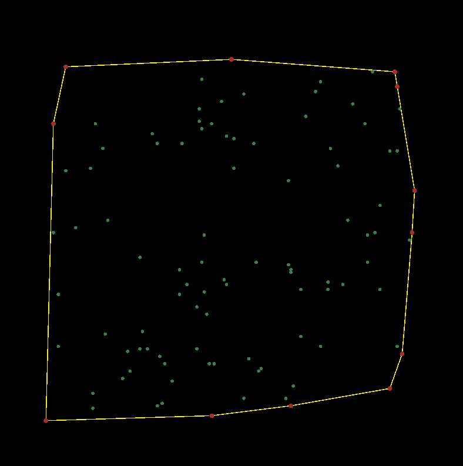

# Convex Hull with Brute Force O(n^3)
> Tugas kecil Stima IF2211 : Convex Hull, brute-force approach.

Thanks to [@yonasadiel](https://github.com/yonasadiel) for giving me the information about how to use OpenGL in conjuction with MinGW. Without his help, the visualization couldn't be created as it is right now.

## Prerequisites
There are several requirements to be fulfilled in order to compile and run this program.
1. Install MinGW C++ compiler on your device.
2. Install [FreeGlut](http://freeglut.sourceforge.net/), download the zip and copy it to your MinGW installation directory.

## Compiling and Running

To compile the program, use `compile.bat`.
To compile and run the program, use `run.bat`.

## Examples

Here's some of author's experiment on using the program.

    

